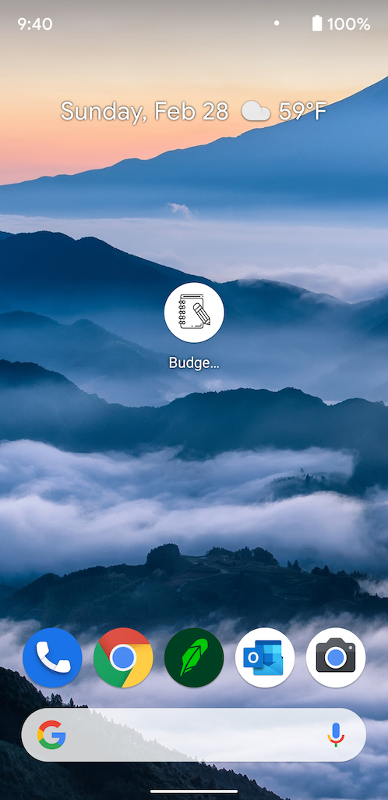

# Budget Tracker

## Objective
To add functionality to Budget Tracker application that allow user to be able to to add expenses and deposits to their budget with or without a connection. When entering transactions offline, they should populate the total when brought back online.

## Acceptance Criteria
- When using the application when no internet connection, the user inputs a withdrawal or deposit
THEN that will be shown on the page, and added to their transaction history when their connection is back online.
- Deploy your application with [Heroku and MongoDB Atlas.](../04-Important/MongoAtlas-Deploy.md)
- Make to application to be progressive web application which will work on any platform on both desktop and mobile devices.

## Application and Github URL

### Github Repository URL
https://github.com/thammaraku/Budget_Tracker

### Heroku Deployed Link
https://agile-bastion-58855.herokuapp.com/

### Application Screenshot-Desktop

### Application Screenshot-Mobile

## Knowledge learned from this assignment
1. Knowing what progressive web app advantages
2. Using service-worker to control how network requests from web page will be handled
3. Using web app manifest to provide information about the progression web application including the appearance when the application is installed to desktop or mobile